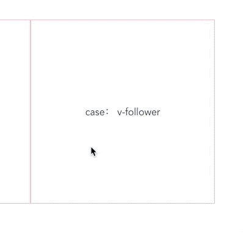

# vue-directive-kit


[](https://github.com/RichardLitt/standard-readme)
[](https://conventionalcommits.org)
[](http://commitizen.github.io/cz-cli/)


> A collection of vue directive.

各种Vue自定义指令合集。

## 目录

- [vue-directive-kit](#vue-directive-kit)
  - [目录](#%e7%9b%ae%e5%bd%95)
  - [安装](#%e5%ae%89%e8%a3%85)
  - [使用](#%e4%bd%bf%e7%94%a8)
    - [imgLazyload](#imglazyload)
    - [imgPlaceholder](#imgplaceholder)
    - [infiniteScroll](#infinitescroll)
    - [鼠标跟随](#%e9%bc%a0%e6%a0%87%e8%b7%9f%e9%9a%8f)
  - [API](#api)
  - [Maintainers](#maintainers)
  - [Contributing](#contributing)
  - [License](#license)


## 安装

**安装**
```bash
npm i vue-directive-kit -D
# yarn add vue-directive-kit -D
```

**全局注册**
</br>
ES Module
```javascript
import vueDirectiveKit from 'vue-directive-kit';
Vue.use(vueDirectiveKit);
```

CommonJs
```javascript
const {default: vueDirectiveKit} = require('vue-directive-kit')
Vue.use(vueDirectiveKit)
```

Script Link
```javascript
<script src="https://cdn.jsdelivr.net/npm/vue"></script>
<script src="https://cdn.jsdelivr.net/npm/vue-directive-kit@latest/lib/vue-directive-kit.min.js"></script>
```


## 使用

### imgLazyload
图片懒加载。当图片出现在浏览器视口才会加载。

```html

```

### imgPlaceholder
在图片加载完成前以占位内容过渡。支持以**随机色**或者**指定图片**占位。

指令默认作用于``标签。也可作用于其他普通元素标签，也就是图片显示为元素背景图，只需为指令添加修饰符`bg`即可。

作用于``标签：
```html

```

作用于元素：
```html
<div v-img-placeholder.bg="'http://api.dujin.org/bing/1920.php'"> </div>
```

若要以指定图片占位，需要传入一个字符串数组，数组第一项是图片地址，第二项是展位图地址。

作用于``标签：
```html

```

作用于元素：
```html
<div v-img-placeholder.bg="['http://api.dujin.org/bing/1920.php','https://www.baidu.com/favicon.ico']" ></div>
```

### infiniteScroll
监听滚动事件并处罚指定事件。可监听window的滚动事件或者指定元素的滚动事件。

监听window的滚动事件
<details>
<summary>Show Me Code</summary>

```html
<template>
    <div>
        <div class="wrapper" v-infinite-scroll="loadDataOpt">
            <ul class="list">
                <li class="item"> </li>
            </ul>
        </div>
    </div>
</template>

<script>
export default {
    data (){
        return {
            loadDataOpt:{
                loadfn: this.fetchData
            }
        }
    },
    methods:{
        fetchData(){
            console.log(`window滚动触发`);
        }
    }
}
</script>
```
</details>


监听指定元素的滚动事件。

<details>
<summary>Show Me Code</summary>

```html
<template>
    <div>
        <div class="wrapper" ref='wrapper'>
            <ul class="list"  v-infinite-scroll="loadDataOpt">
                <li class="item"> </li>
            </ul>
        </div>
    </div>
</template>

<script>
export default {
    data (){
        return {
            loadDataOpt:{
                loadfn: this.fetchData,
                ref: 'wrapper'
            }
        }
    },
    methods:{
        fetchData(){
            console.log(`指定元素滚动触发`);
        }
    }
}
</script>
```
</details>

### 鼠标跟随

在指令作用的元素范围内，生成一个鼠标跟随的元素。
可自定义元素样式及元素内容。

基本用法



<details>
<summary>Show Me Code</summary>

```html
<div v-follower>case： v-follower</div>
```
</details>


自定义提示内容


<details>
<summary>Show Me Code</summary>

```js
<template>
    <div v-follower="options">case： v-follower</div>
</template>

<script>
export default {
    data() {
        return {
            options:{
                txt: "自定义内容"
            }
        };
    }
};
</script>
```
</details>


自定义样式


<details>
<summary>Show Me Code</summary>

```js
<template>
    <div v-follower="options">case： v-follower</div>
</template>

<script>
export default {
    data() {
        return {
            options:{
                txt: "自定义样式",
                style:{
                    "backgroundColor": "#38f",
                    "color": "#fff",
                }
            }
        };
    }
};
</script>
```
</details>


## API

## Maintainers

[@guthub handler](https://github.com/guthub handler)

## Contributing

See [the contributing file](contributing.md)!

PRs accepted.

Small note: If editing the README, please conform to the [standard-readme](https://github.com/RichardLitt/standard-readme) specification.

## License

MIT © 2019 slevin


<details>
<summary>Show Me Code</summary>

code..
</details>
